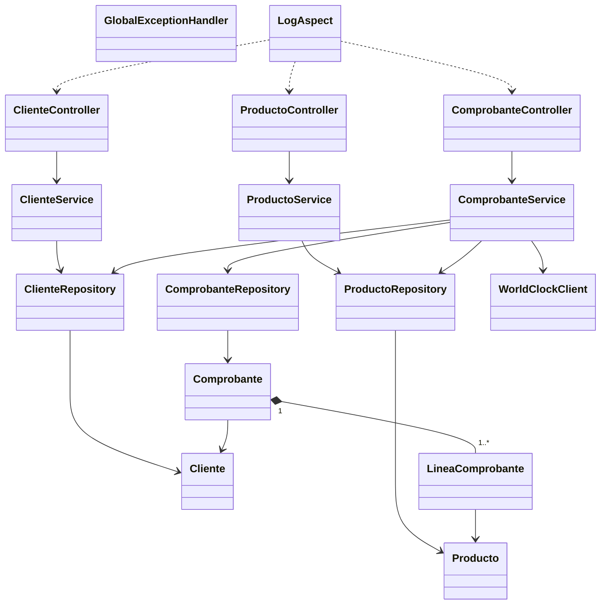

# API de facturación y ventas

API REST desarrollada con **Java 17**, **Spring Boot 3.3.5**, **Spring Web**, **Spring Data JPA**, **Bean Validation**, **H2** y **Spring AOP**. Permite administrar clientes y productos, y emitir comprobantes descontando el stock disponible.

## 1. Requisitos previos

- Java 17 o superior.
- Maven Wrapper incluido (`mvnw.cmd`). No es necesario instalar Maven globalmente.
- PowerShell o una terminal compatible.
- Puerto `8080` disponible.

## 2. Arquitectura de la aplicación

La aplicación utiliza una arquitectura por capas. Las peticiones HTTP ingresan por los controladores, pasan a los servicios de negocio y se persisten mediante repositorios JPA sobre una base H2 en memoria.

### Paquetes y responsabilidades

| Paquete | Clases principales | Responsabilidad |
|---|---|---|
| `controller` | `ClienteController`, `ProductoController`, `ComprobanteController` | Expone endpoints REST, recibe JSON, valida requests y devuelve códigos HTTP. |
| `service` | `ClienteService`, `ProductoService`, `ComprobanteService` | Contiene las reglas de negocio y coordina repositorios e integración externa. |
| `repository` | `ClienteRepository`, `ProductoRepository`, `ComprobanteRepository` | Acceso a datos mediante Spring Data JPA. |
| `entity` | `Cliente`, `Producto`, `Comprobante`, `LineaComprobante` | Entidades persistentes y relaciones de la base de datos. |
| `dto` | Requests y responses de clientes, productos y comprobantes | Define el contrato JSON de la API. |
| `exception` | `GlobalExceptionHandler` y excepciones de negocio | Convierte errores en respuestas HTTP uniformes. |
| `integration` | `WorldClockClient`, `WorldClockResponse` | Consulta la fecha de World Clock y aplica fallback local. |
| `aspect` | `LogAspect` | Registra entradas, respuestas, errores y tiempos de los controladores. |

### Diagrama UML



### Flujo de alta de un comprobante

1. `ComprobanteController` recibe y valida el JSON.
2. `ComprobanteService` verifica que exista el cliente.
3. Busca todos los productos y acumula las cantidades por producto.
4. Valida todo el stock antes de modificar entidades.
5. Calcula subtotales y total usando el precio vigente como precio histórico.
6. Descuenta stock y guarda el comprobante con sus líneas.
7. Devuelve `201 Created`.

Si falta stock, se lanza `StockInsuficienteException`; no se crea el comprobante ni se descuenta stock.

## 3. Requisitos funcionales implementados

### Clientes

- Crear, listar, consultar, actualizar y eliminar clientes.

### Productos

- Crear, listar, consultar y actualizar productos.
- Validar que el precio y el stock no sean negativos.

### Comprobantes

- Crear, consultar y listar comprobantes.
- Asociar el comprobante a un cliente y a una o más líneas de productos.
- Calcular subtotales, total y cantidad total.
- Conservar el precio histórico de cada línea.
- Descontar stock al confirmar la operación.
- Obtener la fecha desde World Clock y usar `LocalDateTime.now()` como fallback.

## 4. Validaciones y manejo de excepciones

| Situación | Respuesta |
|---|---|
| Nombre de cliente vacío | `400 Bad Request` |
| Precio de producto negativo | `400 Bad Request` |
| Stock de producto negativo | `400 Bad Request` |
| Cantidad de línea cero o negativa | `400 Bad Request` |
| Cliente, producto o comprobante inexistente | `404 Not Found` |
| Stock insuficiente | `409 Conflict` |

Ejemplo de validación:

```json
{
  "status": 400,
  "error": "Bad Request",
  "messages": { "precio": "El precio no puede ser negativo" }
}
```

Ejemplo de recurso inexistente:

```json
{
  "status": 404,
  "error": "Not Found",
  "message": "No existe un cliente con ID 9999"
}
```

Ejemplo de stock insuficiente:

```json
{
  "status": 409,
  "error": "Conflict",
  "message": "Stock insuficiente para el producto 'Cerveza Lager'. Disponible: 10, solicitado: 11"
}
```

## 5. Endpoints y ejemplos

La API queda disponible en `http://localhost:8080`.

### Clientes

| Método | Ruta | Resultado |
|---|---|---|
| `POST` | `/clientes` | Crear cliente (`201`) |
| `GET` | `/clientes` | Listar clientes (`200`) |
| `GET` | `/clientes/{id}` | Consultar cliente (`200`) |
| `PUT` | `/clientes/{id}` | Actualizar cliente (`200`) |
| `DELETE` | `/clientes/{id}` | Eliminar cliente (`204`) |

```powershell
Invoke-RestMethod -Method Post -Uri http://localhost:8080/clientes `
  -ContentType 'application/json' `
  -Body '{"nombre":"Ana Pérez","email":"ana@example.com","documento":"30111222"}'
```

### Productos

| Método | Ruta | Resultado |
|---|---|---|
| `POST` | `/productos` | Crear producto (`201`) |
| `GET` | `/productos` | Listar productos (`200`) |
| `GET` | `/productos/{id}` | Consultar producto (`200`) |
| `PUT` | `/productos/{id}` | Actualizar producto (`200`) |

```powershell
Invoke-RestMethod -Method Post -Uri http://localhost:8080/productos `
  -ContentType 'application/json' `
  -Body '{"descripcion":"Cerveza Lager","precio":100.00,"stock":10}'
```

### Comprobantes

| Método | Ruta | Resultado |
|---|---|---|
| `POST` | `/comprobantes` | Crear comprobante y descontar stock (`201`) |
| `GET` | `/comprobantes` | Listar comprobantes (`200`) |
| `GET` | `/comprobantes/{id}` | Consultar comprobante (`200`) |

```powershell
Invoke-RestMethod -Method Post -Uri http://localhost:8080/comprobantes `
  -ContentType 'application/json' `
  -Body '{"cliente":{"clienteId":1},"lineas":[{"cantidad":2,"producto":{"productoId":1}}]}'
```

Respuesta esperada simplificada:

```json
{
  "comprobanteId": 1,
  "total": 200.00,
  "cantidadTotalProductos": 2,
  "lineas": [{
    "cantidad": 2,
    "precioUnitario": 100.00,
    "subtotal": 200.00
  }]
}
```

## 6. Configuración de la base de datos

La aplicación utiliza H2 en memoria:

- URL: `jdbc:h2:mem:ventasdb`.
- Usuario: `sa`.
- Contraseña: vacía.
- `spring.jpa.hibernate.ddl-auto=create-drop`.
- `spring.sql.init.mode=never`.
- Puerto HTTP: `8080`.

Las tablas se crean al iniciar y se eliminan al detener la aplicación. Por lo tanto, los datos se pierden al cerrar el proceso. El archivo `src/main/resources/schema.sql` documenta el esquema, pero no se ejecuta automáticamente con la configuración actual.

## 7. Compilar y ejecutar

Desde `C:\Users\matmoine\OneDrive - Anheuser-Busch InBev\My Documents\proyecto_java`:

```powershell
# Ejecutar pruebas
.\mvnw.cmd test -B

# Empaquetar
.\mvnw.cmd package -B

# Ejecutar el JAR final
java -jar target\FacturacionEntregaProyectoFinalMoine.jar
```

El nombre final se configura en `pom.xml` mediante `<finalName>FacturacionEntregaProyectoFinalMoine</finalName>`.

## 8. Evidencias de ejecución

### Pruebas automatizadas

Última ejecución de Maven:

```text
Tests run: 24, Failures: 0, Errors: 0, Skipped: 0
BUILD SUCCESS
```

Detalle de reportes Surefire:

- `ClienteControllerTests`: 6 pruebas.
- `ProductoControllerTests`: 6 pruebas.
- `ComprobanteControllerTests`: 7 pruebas.
- `WorldClockClientTests`: 2 pruebas.
- `LogAspectTests`: 1 prueba.
- `ClienteRepositoryTests`: 1 prueba.
- `VentasApplicationTests`: 1 prueba.

Se verifican casos exitosos y de error: CRUD, validaciones, recursos inexistentes, cálculo de comprobantes, precio histórico, descuento de stock, stock insuficiente sin efectos parciales y fallback de World Clock.

Los reportes se encuentran en `target/surefire-reports/`.

### Smoke test del JAR y logs

El JAR final fue ejecutado y se validó:

```text
GET /clientes -> HTTP 200
```

Archivos de evidencia:

- `target/renamed-jar-smoke.log`
- `target/renamed-jar-smoke-error.log`

`LogAspect` registra método, argumentos, respuesta o excepción y tiempo de ejecución de los controladores.

## 9. Colección y archivos de entrega

- Colección Postman: `postman/coleccion-ventas.json`.
- Esquema SQL: `src/main/resources/schema.sql`.
- JAR ejecutable: `target/FacturacionEntregaProyectoFinalMoine.jar`.
- Reportes de pruebas: `target/surefire-reports/`.
- Plan de ejecución: `PLAN_EJECUCION.md`.
- Plan del proyecto: `PROYECTO_FINAL_PLAN.md`.

## 10. Pruebas manuales de error

### Precio negativo

```powershell
Invoke-RestMethod -Method Post -Uri http://localhost:8080/productos `
  -ContentType 'application/json' `
  -Body '{"descripcion":"Producto inválido","precio":-1,"stock":10}'
```

Resultado esperado: `400 Bad Request` y `messages.precio`.

### Stock insuficiente

Con un producto cuyo stock es `10`, solicitar `11` unidades en `/comprobantes`.

Resultado esperado: `409 Conflict`; no se crea el comprobante y el stock permanece en `10`.

### Recurso inexistente

```powershell
Invoke-WebRequest -Method Get -Uri http://localhost:8080/clientes/9999
```

Resultado esperado: `404 Not Found`.